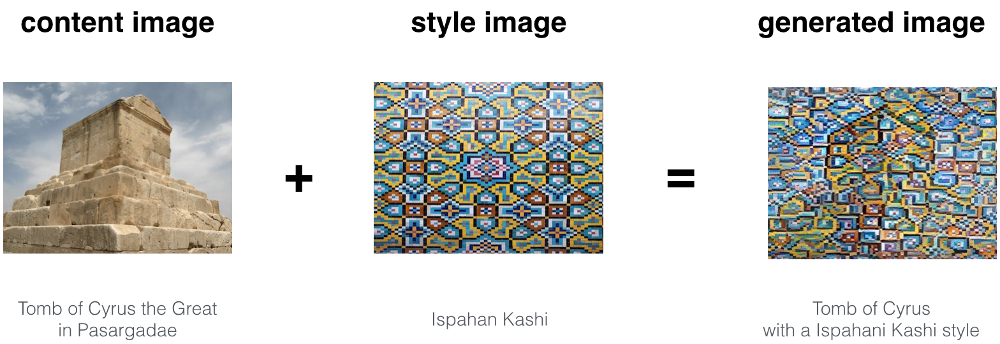
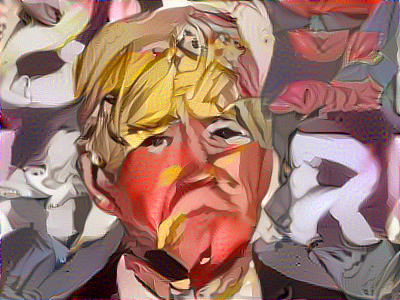
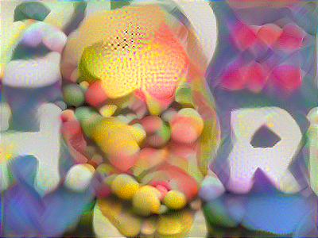
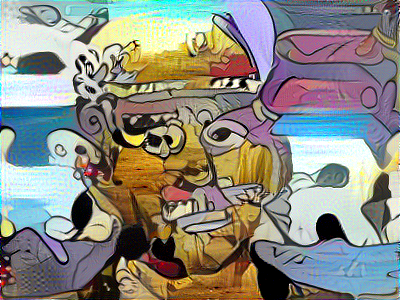
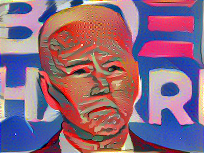
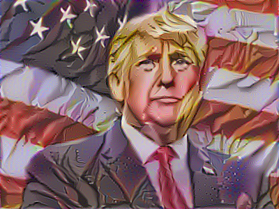
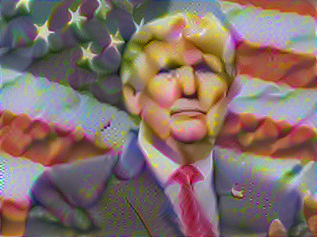
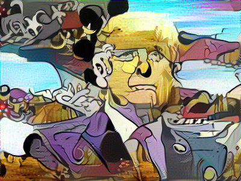
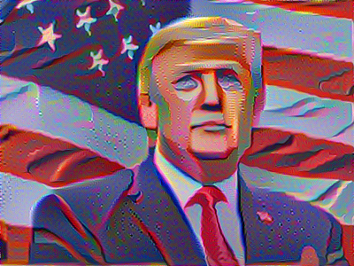

# TensorFlow 2.4.1 Neural Style Transfer
TensorFlow 2.4.1 Neural Style Transfer

This application is a port of the Neural Style Transfer application shown in Andy NG's Coursera Deep Learning specialization.

The application was written in using TensorFlow 1.4 for the `Art generation with Neural Style Transfer` programming assignment.

To allow it to run faster, I have upgrade the application has been to use ensorFlow 2.4 and run on a modern GPU.

##Getting started.

Befor you can run the application, you will need to use 7Zip to extract the petrained model located in the `./pretrained-model` folder. 

It has been split into 6 volumes, imagenet-vgg-verydeep-19.7z.001 - to imagenet-vgg-verydeep-19.7z.006, each 100 mb in size (Github's file size limit.

Simply right click imagenet-vgg-verydeep-19.7z.001 and choose extract here.

The application expects the extracted model to be located at `./pretrained-model/pretrained-model.mat`

Also, if you have issues with packages, see the packages installed in requirements.txt.

You may optionally run pip install to install those packages but those are all packages installed my environment and this application does need them all.

## Usage:

Modify the `NeuralStyleTransfer.py` script to set the `contentImagePath` and `styleImagePath` according.

`contentImagePath` is the image you want to transfer the style to.

`styleImagePath` is the image you want to transfer the style form

Note: By default, images must be 400 px wide by 300px high.

## Examples:
After running the application you. generated images will be saved to the `./output` directory something the image presented below on the right:

A few other examples:

- The beautiful ruins of the ancient city of Persepolis (Iran) with the style of Van Gogh (The Starry Night)

- The tomb of Cyrus the great in Pasargadae with the style of a Ceramic Kashi from Ispahan.

- A scientific study of a turbulent fluid with the style of a abstract blue fluid painting.

## More Examples:

- A generated image of Joe Biden applying an anime style image.

- A generated image of Joe Biden applying an easter egg style image to the same image as above.

- A generated image of Joe Biden applying an image from a classic cartoon to the same image as above.

- A generated image of Joe Biden applying the change theme to the same image as above

Now, the same images for Donald Trump.

- A generated image of Donald Trump applying an anime style image.

- A generated image of Donald Trump applying an easter egg style image to the same image as above.

- A generated image of Donald Trump applying an image from a classic cartoon to the same image as above.

- A generated image of Joe Biden applying the change theme to the same image as above.

## Fine Tuning:

- You can change the learning rate and the number of iterations to get different results.

### References:

The Neural Style Transfer algorithm was due to Gatys et al. (2015). Harish Narayanan and Github user "log0" also have highly readable write-ups from which we drew inspiration. The pre-trained network used in this implementation is a VGG network, which is due to Simonyan and Zisserman (2015). Pre-trained weights were from the work of the MathConvNet team. 

- Andrew Ng, [DeepLearning.ai Deep Learning Specialization on Coursera](https://www.coursera.org/specializations/deep-learning)
- Leon A. Gatys, Alexander S. Ecker, Matthias Bethge, (2015). [A Neural Algorithm of Artistic Style](https://arxiv.org/abs/1508.06576) 
- Harish Narayanan, [Convolutional neural networks for artistic style transfer.](https://harishnarayanan.org/writing/artistic-style-transfer/)
- Log0, [TensorFlow Implementation of "A Neural Algorithm of Artistic Style".](http://www.chioka.in/tensorflow-implementation-neural-algorithm-of-artistic-style)
- Karen Simonyan and Andrew Zisserman (2015). [Very deep convolutional networks for large-scale image recognition](https://arxiv.org/pdf/1409.1556.pdf)
- [MatConvNet.](http://www.vlfeat.org/matconvnet/pretrained/)
